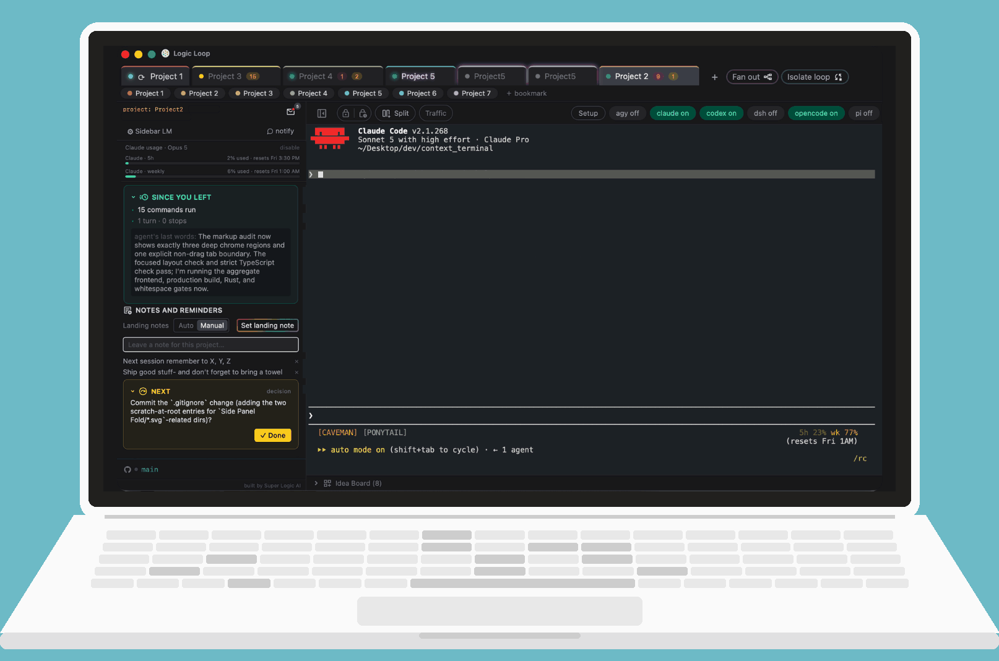
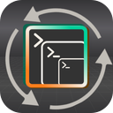

[](#how-it-works)

<h1 align="center">
  <a href="https://github.com/SuperLogicAI/Logic-Loop"></a>
  &nbsp;Logic Loop
  <a href="https://superlogicai.com"></a>
</h1>

<p align="center">Effortlessly switch between multiple concurrent AI coding agent terminal sessions.</p>

---

<p align="center">
  <strong><span style="color: #00C291;">Run more agents across more projects.</span></strong>
  <strong><span style="color: #FF7E1B;">Lose nothing in between.</span></strong><br><br>
  Every switch between projects costs you- a few seconds to reload state, a few minutes to wrap your head around it, and a slow drain that compounds across your day. Logic Loop keeps the context loaded so you don't have to. Jump between projects and coding agents without rebuilding the picture in your head each time.
</p>

<p align="center"><strong>Agents</strong></p>

<p align="center">
  <a href="https://github.com/google-antigravity/antigravity-cli"></a>
  <a href="https://claude.com/claude-code"></a>
  <a href="https://github.com/openai/codex"></a>
  <a href="https://www.npmjs.com/package/@deepseek-ai/dsh"></a>
  <a href="https://github.com/earendil-works/pi"></a>
</p>

<p align="center"><strong>Features</strong></p>

<p align="center">
  <a href="docs/TESTING.md#22-clickable-links-in-terminal-output-2026-08-29"></a>
  <a href="docs/TESTING.md#9-bookmarks"></a>
  <a href="plans/008-preserve-tab-presentation-on-reentry.md"></a>
  <a href="#account-and-usage-meters"></a>
  <a href="#why"></a>
  <a href="plans/007-landing-note-manual-auto.md"></a>
  <a href="#why"></a>
  <a href="#decision-debt"></a>
  <a href="docs/TESTING.md#28-idea-board-phase-18"></a>
  <a href="#model-traffic-optional"></a>
  <a href="docs/TESTING.md#34-blockers-bulk-clear-phase-24"></a>
  <a href="docs/TESTING.md#26-diff-pop-out-from-accomplished-rows-issue-10"></a>
  <a href="docs/TESTING.md#36-cross-project-attention-inbox-phase-26"></a>
</p>

[](#macos-build-from-source)

Logic Loop is an open-source, cross-platform desktop app built by [Super Logic AI](https://superlogicai.com). Originally created for macOS, it now supports macOS, Linux, and Windows while helping people manage the context-switching demands of running several AI coding agent terminal sessions at once — Claude Code, OpenCode, Codex, Antigravity, Pi Agent, and DeepSeek Harness today, with more adapters planned. Every competing tool tells you what your *agents* are doing. Logic Loop tells you what *you* need to do — and remembers everything you'd otherwise lose in the switch.

> Agent viewers manage the agents' context. Logic Loop manages yours.

---

## Why

The bottleneck in multi-agent development is no longer the model's context window — it's the operator's working memory. Run four Claude Code sessions and the cost isn't watching them; it's the tax you pay every time you switch: lost open questions, forgotten state, re-reading a terminal to remember where you were.

Each panel in Logic Loop counters a documented failure mode of human task switching:

| Panel | What it counters |
| --- | --- |
| **Decision Tracker** | *Missed forks* — the agent asks two questions, you answer one, the second silently dies and the agent decides for you. |
| **Accomplished** | *Progress blindness* — re-entry starts with "where was I?" instead of "what's next?" |
| **Since You Left** | *Catch-up cost on a long unattended run* — a deterministic digest (files touched, bash runs/errors, turns, decisions opened) of everything that happened while a tab was out of view, loop ticks collapsed to `×N no change` so a long autonomous run reads as one line instead of a scrollback. |
| **Blockers** | *Non-viable switches* — switching into a project only to find it's waiting on something external. |
| **Landing Note** | *State reconstruction cost* — rebuilding mental state on return can take 15–25 min; a written next action collapses it. Auto (default) drafts on departure; Manual, toggled from Notes and reminders, skips the popup/draft/countdown and lets a rainbow-bordered capture action save your own note inline. |
| **Attention Residue** | *Attention residue* — part of your mind stays on the task you left; externalize the loop to return clean. |
| **Momentum Builder** | *Re-entry friction* — surfaces the single lowest-friction next action to convert staring into motion. |
| **Idea Board** | *Where did that idea go* — a per-project kanban dock (idea → planned → building → later → done) living in a git-committed `.logic-loop/board.md`; star up to 3 cards as "Now" and Momentum Builder prefers them over the plain top-of-column pick. |
| **Attention Inbox** | *Which of my N projects needs me* — a cross-project, keyboard-driven (`Cmd/Ctrl+K`) rollup of every open decision, unclaimed result, unresolved blocker, and stalled-quiet session across all tabs, ranked actionability-first with searchable per-row jump-to-tab. |

Two supporting controls round out re-entry and focus: a **folded/compact side rail** — collapse any expanded panel down to icon-only, click an icon to jump back to its section — for when screen space matters more than detail, and **Lock-in** (Do Not Disturb, indefinite or a 1-hour timer) — the side panel goes neutral and OS notifications/dock badge stay silent while every panel, hook, and background session keeps updating underneath, so nothing is missed, just not pushed at you. A header **Split** control opens a second ordinary terminal in the focused project's directory and keeps two independently tethered tabs visible side by side; the project panel follows whichever pane has focus.

## Decision debt

The failure mode Logic Loop was built around, and the one no amount of agent visibility fixes: an agent hits a fork, and the fork never reaches you.

It looks like this. You ask for a change. The agent has two reasonable ways to do it, mentions both in passing, picks one, and keeps going. Or it asks two questions in one message, you answer the first, and the second quietly becomes whatever the model assumed. Or you say "ask me before editing" and it answers the question itself, because it was confident. The terminal shows a finished task. Nothing shows the choice that was made for you.

Every one of those is a small debt. Each is cheap to repay in the moment (one line from you) and expensive later, when the assumed answer has been built on for twenty turns and you find out at review, or in production. Run four agents in parallel and the debt compounds faster than you can read.

Logic Loop's answer is the **Decision Tracker**, and the design rule behind it matters more than the panel:

- **Forks are observed, not self-reported.** Asking the agent to flag when it needs you only catches the forks it noticed. The ones it resolved silently are exactly the ones it did not notice. So the tracker reads the agent's own transcript after each turn and extracts open questions from what was actually said, including questions the agent raised and then answered for itself, and questions embedded in a paragraph you skimmed past.
- **Extraction leans conservative.** A card for a question that was never a real fork wastes your attention. A missed fork costs a rework. The prompt, the model choice, and the golden test set are all tuned toward fewer cards, higher precision. Over-extraction is treated as the worse bug.
- **Answering is one action, not a context switch.** Each card carries the question and an *Answer now* control that lands your reply in the right tab. Answering closes the card deterministically. Dismissing is one click. Stale clusters bulk-dismiss by session.
- **Debt is visible across projects.** Open decisions roll up into the Attention Inbox with unclaimed results and blockers, so "which of my projects is waiting on a choice I never made" is one keystroke.
- **The app never answers for you.** It observes and displays. It never writes into a running session on its own. That is an architectural invariant, not a setting.

The rest of the side panel exists to make coming back cheap. This panel exists so that when you come back, the decisions are still yours.

## How it works

Logic Loop never scrapes the terminal screen. Semantic events come from structured agent protocols only — an agent's lifecycle **hooks** (Claude Code, Codex, Antigravity), its JSONL session **transcripts**, or its own plugin/event API where one exists (OpenCode) — deterministic, structured, no ANSI parsing. Raw PTY bytes pass through untouched. Panels are plain SQL views over an append-only event log; the only place an LLM is used is the ambiguous 10% (did your reply address every question the agent asked?), and even that fails open — if extraction breaks, the terminals keep working.

Every adapter normalizes to one wire shape, so a tab running any of them gets the same state dots, rollups and fan-out tracking. Each installs itself into that agent's own global config only after an explicit click, and removes itself byte-identically when switched off. On first run, the **Setup** checklist shows which supported CLIs are detected, explains each adapter's actual depth, and waits for the first structured event before calling a connection live. Setup can be skipped and reopened from the header at any time. Notification permission is likewise requested only from the checklist after its purpose is explained. [AGENTS.md](AGENTS.md) is this repo's own shared contract for coding agents working on Logic Loop itself — repo map, verify commands, and invariants in one place, readable by OpenCode and Codex alongside Claude Code.

## Supported agents

| Agent | Activity, state & fan-out | Decision / blocker extraction | Notes |
| --- | --- | --- | --- |
| **Claude Code** | ✅ | ✅ | Hooks + JSONL transcript tailing. The reference adapter. Resume/re-entry supported. |
| **OpenCode** | ✅ | ✅ | In-process plugin translating native events; no transcript file to tail — extraction feeds directly off in-process message content instead, including questions asked via OpenCode's own `question` tool. Resume/re-entry via `opencode -s <id>`, live-verified. |
| **Codex** | ✅ | ✅ | Hook contract is near-identical to Claude's; registers into `~/.codex/hooks.json`. Carries its own adapter marker, resumes via `codex resume`, handles `Interrupt`/`SessionEnd` lifecycle events, and can back the Sidebar LM extractor. |
| **[Antigravity](https://github.com/google-antigravity/antigravity-cli)** (`agy`) | ✅ | — | Structured hooks and session re-entry via `agy --conversation <id>`; quit/relaunch and prior-context recall verified with agy 1.2.4. See caveats below. |
| **[Pi Agent](https://github.com/earendil-works/pi)** (`pi`) | ✅ | ✅ | In-process global TypeScript extension (`~/.pi/agent/extensions/logic-loop.ts`) translating lifecycle events and finalized visible messages; no terminal parsing or session-file tailing. Session re-entry via `pi --session <id>`, live-verified ([Plan 026](plans/026-pi-agent-adapter.md)); extraction added in [Plan 039](plans/039-pi-decision-extraction.md). |
| **[DeepSeek Harness](https://www.npmjs.com/package/@deepseek-ai/dsh)** (`dsh`) | ✅ | ✅ | Runs as `dsh --profile logic-loop`. Logic Loop's profile patch extracts only the exact submitted line and finalized, appended visible text from the in-memory Harness session log—never terminal output or persisted session files. Session re-entry via `--resume <sessionId>`, proven cross-process. |

Decision and blocker extraction is available for Claude Code, Codex, OpenCode, Pi, and DeepSeek Harness. The Sidebar LM chooser supports Claude CLI (default), Codex CLI, and LM Studio (local); Codex CLI uses its configured default model unless an optional model override is supplied. A submitted structured reply from a supported adapter can conservatively close older open questions from that same session; **Answer now** only focuses and prefills the bound terminal, so cancelling the draft never creates false answer state. The Decisions panel groups open questions into per-session, collapsible clusters (newest expanded, one "dismiss all" per cluster) instead of one flat list, and its empty state now says *why* nothing's showing rather than one generic "nothing waiting" — confirmed-empty, blind session (no transcript), unbound fan-out child, or "not available for this agent" are each called out distinctly.

Antigravity's tool activity (file edits, commands run) now shows real detail in the Accomplished panel and Since-you-left digest, and a second turn in the same session correctly returns the tab to "working" instead of freezing on "idle" — both were Logic Loop-side gaps, now fixed.

Antigravity session re-entry was completed in [Plan 025](plans/025-antigravity-session-reentry.md). `agy` 1.2.4 restored a disposable conversation in a new CLI process; the Logic Loop dev app then restored a ghost tab with its title and color and re-entered the same conversation with prior context intact. Setup now labels re-entry supported. Decision extraction remains unavailable for Antigravity.

One Antigravity-specific limit remains, upstream in `agy` and not fixable from this side (full derivation in [docs/TESTING.md](docs/TESTING.md) §21):

- A tool call that exits non-zero is indistinguishable from one that succeeded — `agy` strips the field carrying that status before the hook sees it, so an `agy` tab shows "working" rather than "error" on a failed command. Everything else still lands.

`agy`'s separate `PostToolUse` named-hook merge bug (present through earlier `agy` releases) is confirmed fixed upstream as of `agy` 1.1.27. Logic Loop now also detects a foreign `PostToolUse` hook in `~/.gemini/config/hooks.json` at setup time and surfaces a warning strip if one is found, so an older or regressed `agy` install fails loud instead of silently dropping every tool event.

## Account and usage meters

The active Claude Code tab's sidebar can show which model the session is on plus two account allowance bars — 5-hour and weekly — with used percentage and reset time. The source is Claude Code's own documented `statusLine` JSON, not a local token count. Logic Loop wraps an **existing** `statusLine.command` after an explicit click: your original command still runs and renders exactly as before, and switching the wrapper off restores the original byte for byte. A tab with no status line configured is told so rather than having one created for it.

Codex tabs get the equivalent from Codex's own app-server — session model plus each named rate-limit bucket it reports, shown separately rather than summed, because the response does not map buckets to the active model.

Both are read-only gauges of an account-wide number that happens to be visible because that tab is bound and active. Neither is joined across tabs, persisted to the database, or turned into a dollar figure.

## Model traffic (optional)

Logic Loop can also read the metadata log written by **[Safe Router](https://github.com/SuperLogicAI/safe_router)**, a headless, local-first model router from the same project. Safe Router keeps designated clients on approved local backends, brokers explicitly authorized remote requests, and records what was requested, served, and reported as used — never prompts or responses.

If your agents route through it, a header **Traffic** control opens a global list of the latest 100 routed requests: time, client key ID, requested versus served model, backend, plane, disposition and status, token counters, and whether usage was fully recorded. That answers something no single agent's own interface can — *which model tier actually served this request* — across every agent and project at once.

It is strictly a read. Logic Loop opens `~/.safe-router/log.db` read-only (`mode=ro` plus `PRAGMA query_only=1`) on its own connection, never creates the file, never writes to it, and selects only from the versioned `v_requests_v2` view, never the underlying table. Safe Router remains a separate process and the sole writer.

Entirely optional: with no Safe Router installed, the control simply reports that no log was found, and nothing else in Logic Loop depends on it. No cost or dollar figure is shown — the counters are provider-reported metadata, not a bill, and a NULL reads as unknown while a recorded `0` reads as `0`. The `client_tag` field is client-supplied text, so no row is attributed to a tab or project.

Shipped in [Plan 022](plans/022-safe-router-traffic-view.md). Its manual macOS matrix ([docs/TESTING.md](docs/TESTING.md) §57) has not been run yet.

## Status

Early, actively built, dogfooded daily. Shipped:

- ✅ Terminal shell — tabs, real PTYs, per-session state dots
- ✅ Event spine — hook ingestion + transcript tailing
- ✅ Accomplished + Blockers panels (deterministic)
- ✅ Decision Tracker with fork detection
- ✅ Landing Note · Attention Residue · Momentum Builder
- ✅ Re-entry, unclaimed-result tracking, desktop nudges
- ✅ Fan-out spawn groups — launch and track several agents from one session
- ✅ OpenCode adapter — first non-Claude ingestion pipeline
- ✅ Codex adapter — adapter identity marker, resume/re-entry, Interrupt/SessionEnd lifecycle
- ✅ Isolated loops (git worktree–backed tabs)
- ✅ Antigravity (`agy`) adapter — multi-turn tracking fix, normalized tool detail, foreign-`PostToolUse`-hook detection
- ✅ Decisions grouped by session with per-cluster bulk-dismiss
- ✅ Decisions empty-state clarity — distinguishes confirmed-empty from blind/unbound/non-Claude-agent
- ✅ Idea Board — per-project kanban dock with a starred "Now" set
- ✅ Cross-project Attention Inbox — `Cmd/Ctrl+K` searchable rollup of decisions, unclaimed results, blockers, and stalled sessions across all open projects, with archive/backlog triage for unavailable rows
- ✅ Folded/compact side rail — icon-only panel mode, width and mode persist
- ✅ Blockers bulk clear — resolve every open blocker for a project in one action
- ✅ Lock-in (Do Not Disturb) — indefinite or 1-hour-timed, mutes notifications/dock badge without pausing ingestion
- ✅ First-run agent setup — detection, capability depth, explicit hook install, first-event confirmation, and contextual notification consent
- ✅ Two-terminal split view — a second ordinary tab in a fixed vertical split, each pane independently tethered
- ✅ Commit & Push footer — drafts a commit message, stages, pushes and opens a PR without leaving the tab; untracked files are always opt-in, and the tab is checked back out to the branch it started on
- ✅ Pi Agent adapter — in-process extension, activity, decision extraction and session re-entry
- ✅ DeepSeek Harness adapter — Logic Loop's own profile patch, activity, decision extraction and cross-process re-entry
- ✅ Claude usage meter — 5-hour and weekly account bars from Claude Code's own `statusLine` JSON, wrapping an existing status line reversibly
- ✅ Codex account meter — session model and each reported rate-limit bucket, read from Codex's app-server
- ✅ Safe Router traffic view — optional, read-only list of recent routed requests and which model tier served them
- ⏳ Crash recovery, public release polish

## Stack

Tauri v2 (Rust core) · portable-pty · React + TypeScript + Tailwind · xterm.js · SQLite (tauri-plugin-sql) · localhost hook-ingest server.

## Requirements

- macOS (Apple Silicon) — primary, daily-dogfooded platform.
- Windows — early testing build, see below.
- A packaged app or installer does **not** require Rust or Node on the machine where it runs. Building from source does; see the macOS steps below.
- For agent activity, install at least one supported CLI: [Claude Code](https://claude.com/claude-code), [OpenCode](https://opencode.ai), [Codex](https://github.com/openai/codex), [Antigravity](https://github.com/google-antigravity/antigravity-cli) (`agy`), [Pi Agent](https://github.com/earendil-works/pi) (`pi`), or [DeepSeek Harness](https://www.npmjs.com/package/@deepseek-ai/dsh) (`dsh`). Each is detected independently — `PATH`, Homebrew prefixes, and the usual install locations. You can open a plain terminal tab without an agent CLI.

## macOS (build from source)

The Windows installer workflow does not produce a macOS app. To build Logic Loop on an Apple Silicon Mac, install [Rust](https://rustup.rs) and Node 18+ first, then run:

```bash
git clone https://github.com/SuperLogicAI/Logic-Loop.git
cd Logic-Loop
npm ci
npm run tauri build
open "src-tauri/target/release/bundle/macos/Logic Loop.app"
```

The Rust installation prompt is expected for this build path, not when opening an already-built `.app`.

## Windows (early testing)

CI compiles and tests the Rust core on `windows-latest` on every push, but the macOS build is what's dogfooded daily — treat Windows as early/unverified.

To get an installer:

1. Go to [Actions → Windows build](../../actions/workflows/windows-build.yml) in this repo.
2. Run the workflow (`Run workflow` button, `main` branch), or grab the artifact from the latest run if one already exists.
3. Once it finishes, open the run and download the `logic-loop-windows-unsigned` artifact — it's a zip containing a `*-setup.exe` NSIS installer.
4. Run the installer. It's **unsigned**, so Windows SmartScreen will warn — click **More info → Run anyway**.

The installer includes the app; Rust and Node are not needed on the test PC. No installer is published automatically; each run builds from whatever's on `main` at the time.

Before testing an agent, check the basic terminal flow: click **+** to open a tab, run `echo hello`, then add a bookmark for an existing folder and click the new bookmark to open another tab. A Windows tester has reported that **+** and bookmark opening did nothing; this has not yet been reproduced or fixed. If either action fails, report it via GitHub Issues with your Windows version, the workflow run or installer artifact used, what you clicked, and any visible error. Please also report crashes, PTY quirks, and missing agent detection; include the agent CLI and version when relevant.

## Development

```bash
npm install
npm run tauri dev     # run the app
npm run build         # tsc + vite build
```

## Contributing

Bug reports, adapter requests and PRs welcome — see [CONTRIBUTING.md](CONTRIBUTING.md) for setup, the merge gates, and the architecture rules that aren't up for debate.

## License

[GNU GPLv3](LICENSE).

---

Built and maintained by [Super Logic AI](https://superlogicai.com) — AI automation for small businesses.

Also from Super Logic AI: **[Safe Router](https://github.com/SuperLogicAI/safe_router)**, a headless, local-first model router. It keeps designated clients on approved local backends, brokers explicitly authorized remote requests, and writes a private metadata log of what was requested, served, and reported as used — prompts and responses are never stored in it.
