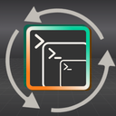

<h1>
  
  &nbsp;Logic Loop
</h1>

**Effortlessly switch between multiple concurrent AI coding agent terminal sessions — a macOS app.**


Logic Loop is an open-source macOS app, built by [Super Logic AI](https://superlogicai.com),
that aids the human's context-switching limits while running several AI coding
agent terminal sessions at once — Claude Code, OpenCode, Codex and Antigravity
today, more adapters planned. Every competing tool tells you what your *agents*
are doing. Logic Loop tells you what *you* need to do — and remembers
everything you'd otherwise lose in the switch.

> Agent viewers manage the agents' context. Logic Loop manages yours.

---

## Why

The bottleneck in multi-agent development is no longer the model's context
window — it's the operator's working memory. Run four Claude Code sessions and
the cost isn't watching them; it's the tax you pay every time you switch: lost
open questions, forgotten state, re-reading a terminal to remember where you
were.

Each panel in Logic Loop counters a documented failure mode of human task
switching:

| Panel | What it counters |
|---|---|
| **Decision Tracker** | *Missed forks* — the agent asks two questions, you answer one, the second silently dies and the agent decides for you. |
| **Accomplished** | *Progress blindness* — re-entry starts with "where was I?" instead of "what's next?" |
| **Blockers** | *Non-viable switches* — switching into a project only to find it's waiting on something external. |
| **Landing Note** | *State reconstruction cost* — rebuilding mental state on return can take 15–25 min; a written next action collapses it. |
| **Attention Residue** | *Attention residue* — part of your mind stays on the task you left; externalize the loop to return clean. |
| **Momentum Builder** | *Re-entry friction* — surfaces the single lowest-friction next action to convert staring into motion. |

## How it works

Logic Loop never scrapes the terminal screen. Semantic events come from
structured agent protocols only — an agent's lifecycle **hooks** (Claude Code,
Codex, Antigravity), its JSONL session **transcripts**, or its own
plugin/event API where one exists (OpenCode) — deterministic, structured, no
ANSI parsing. Raw PTY bytes pass through untouched. Panels are plain SQL views
over an append-only event log; the only place an LLM is used is the ambiguous
10% (did your reply address every question the agent asked?), and even that
fails open — if extraction breaks, the terminals keep working.

Every adapter normalizes to one wire shape, so a tab running any of them gets
the same state dots, rollups and fan-out tracking. Each installs itself into
that agent's own global config via a toggle in the app, and removes itself
byte-identically when switched off.

## Supported agents

| Agent | Activity, state & fan-out | Decision / blocker extraction | Notes |
|---|---|---|---|
| **Claude Code** | ✅ | ✅ | Hooks + JSONL transcript tailing. The reference adapter. |
| **OpenCode** | ✅ | — | In-process plugin translating native events; no transcript file to tail. |
| **Codex** | ✅ | — | Hook contract is near-identical to Claude's; registers into `~/.codex/hooks.json`. |
| **[Antigravity](https://github.com/google-antigravity/antigravity-cli)** (`agy`) | ✅ | — | See caveats below. |

Decision and blocker extraction is Claude-only by design — the other agents
expose no transcript in a shape the extractor reads, and normalizing them is
its own piece of work rather than a flag to flip.

Two Antigravity-specific limits, both upstream in `agy` and neither fixable
from this side (full derivation in [docs/TESTING.md](docs/TESTING.md) §21):

- A tool call that exits non-zero is indistinguishable from one that
  succeeded — `agy` strips the field carrying that status before the hook
  sees it, so an `agy` tab shows "working" rather than "error" on a failed
  command. Everything else still lands.
- `agy` doesn't merge multiple named `PostToolUse` hooks despite documenting
  that it does. If you already have your own `PostToolUse` hook in
  `~/.gemini/config/hooks.json`, Logic Loop's may never fire — the toggle
  will still read "on". Check for a foreign hook first if no rows appear.

## Status

Early, actively built, dogfooded daily. Shipped:

- ✅ Terminal shell — tabs, real PTYs, per-session state dots
- ✅ Event spine — hook ingestion + transcript tailing
- ✅ Accomplished + Blockers panels (deterministic)
- ✅ Decision Tracker with fork detection
- ✅ Landing Note · Attention Residue · Momentum Builder
- ✅ Re-entry, unclaimed-result tracking, desktop nudges
- ✅ Fan-out spawn groups — launch and track several agents from one session
- ✅ OpenCode adapter — first non-Claude ingestion pipeline
- ✅ Codex adapter
- ✅ Isolated loops (git worktree–backed tabs)
- ✅ Antigravity (`agy`) adapter
- ⏳ Crash recovery, onboarding, public release polish

## Stack

Tauri v2 (Rust core) · portable-pty · React + TypeScript + Tailwind ·
xterm.js · SQLite (tauri-plugin-sql) · localhost hook-ingest server.

## Requirements

- macOS (Apple Silicon)
- [Rust](https://rustup.rs) + Node 18+
- At least one supported agent CLI installed — [Claude Code](https://claude.com/claude-code),
  [OpenCode](https://opencode.ai), [Codex](https://github.com/openai/codex),
  or [Antigravity](https://github.com/google-antigravity/antigravity-cli)
  (`agy`). Each is detected independently — `PATH` plus the
  usual install locations — and its toggle appears only once found.

## Development

```bash
npm install
npm run tauri dev     # run the app
npm run build         # tsc + vite build
```

## License

[GNU GPLv3](LICENSE).

---

Built and maintained by [Super Logic AI](https://superlogicai.com) — AI automation
for small businesses.
