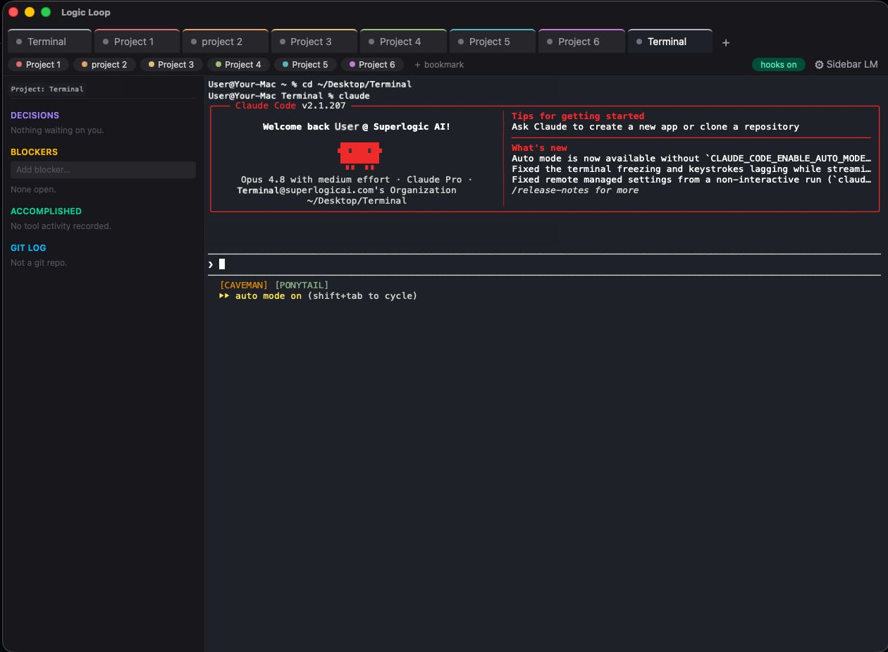

# Logic Loop

**Effortlessly switch between multiple concurrent Claude Code terminal sessions — a macOS app.**



Logic Loop is an open-source macOS app that aids the human's context-switching
limits while running several Claude Code terminal sessions at once. Every
competing tool tells you what your *agents* are doing. Logic Loop tells you what
*you* need to do — and remembers everything you'd otherwise lose in the switch.

> Agent viewers manage the agents' context. Logic Loop manages yours.

---

## Why

The bottleneck in multi-agent development is no longer the model's context
window — it's the operator's working memory. Run four Claude Code sessions and
the cost isn't watching them; it's the tax you pay every time you switch: lost
open questions, forgotten state, re-reading a terminal to remember where you
were.

Each panel in Logic Loop counters a documented failure mode of human task
switching:

| Panel | What it counters |
|---|---|
| **Decision Tracker** | *Missed forks* — the agent asks two questions, you answer one, the second silently dies and the agent decides for you. |
| **Accomplished** | *Progress blindness* — re-entry starts with "where was I?" instead of "what's next?" |
| **Blockers** | *Non-viable switches* — switching into a project only to find it's waiting on something external. |
| **Landing Note** | *State reconstruction cost* — rebuilding mental state on return can take 15–25 min; a written next action collapses it. |
| **Attention Residue** | *Attention residue* — part of your mind stays on the task you left; externalize the loop to return clean. |
| **Momentum Builder** | *Re-entry friction* — surfaces the single lowest-friction next action to convert staring into motion. |

## How it works

Logic Loop never scrapes the terminal screen. Semantic events come from Claude
Code's lifecycle **hooks** and its JSONL session **transcripts** — deterministic,
structured, no ANSI parsing. Raw PTY bytes pass through untouched. Panels are
plain SQL views over an append-only event log; the only place an LLM is used is
the ambiguous 10% (did your reply address every question the agent asked?), and
even that fails open — if extraction breaks, the terminals keep working.

## Status

Early, private, actively built. Shipped and in progress:

- ✅ Terminal shell — tabs, real PTYs, per-session state dots
- ✅ Event spine — hook ingestion + transcript tailing
- ✅ Accomplished + Blockers panels (deterministic)
- ✅ Decision Tracker with fork detection
- 🚧 Landing Note · Attention Residue · Momentum Builder
- ⏳ Crash recovery, onboarding, public release

## Stack

Tauri v2 (Rust core) · portable-pty · React + TypeScript + Tailwind ·
xterm.js · SQLite (tauri-plugin-sql) · localhost hook-ingest server.

## Requirements

- macOS (Apple Silicon)
- [Rust](https://rustup.rs) + Node 18+
- [Claude Code](https://claude.com/claude-code) installed

## Development

```bash
npm install
npm run tauri dev     # run the app
npm run build         # tsc + vite build
```

## License

[GNU GPLv3](LICENSE).
