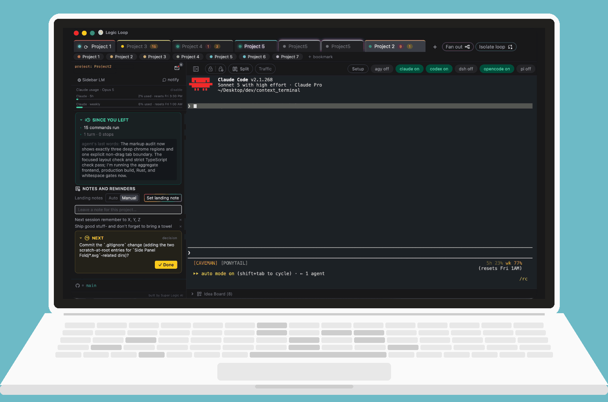
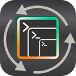

[](#what-you-get)
<!-- TODO(maintainer): recapture from a demo profile, never the real one (no client or project names): Home → Overview → a Decisions card → Next. -->

<h1 align="center">
  <a href="https://github.com/SuperLogicAI/Logic-Loop"></a>
  &nbsp;Logic Loop
  <a href="https://superlogicai.com"></a>
</h1>

<p align="center"><strong>Coding agents move fast. Logic Loop helps you keep up. Keep your place across AI coding projects.</strong></p>

<p align="center"><strong>Agents</strong></p>

<p align="center">
  <a href="https://github.com/google-antigravity/antigravity-cli"></a>
  <a href="https://claude.com/claude-code"></a>
  <a href="https://github.com/openai/codex"></a>
  <a href="https://www.npmjs.com/package/@deepseek-ai/dsh"></a>
  <a href="https://opencode.ai"></a>
  <a href="https://github.com/earendil-works/pi"></a>
</p>

<p align="center"><strong>Features</strong></p>

<p align="center">
  <a href="#what-you-get"></a>
  <a href="#what-you-get"></a>
  <a href="#supported-agents"></a>
  <a href="#what-you-get"></a>
  <a href="#what-you-get"></a>
  <a href="#what-you-get"></a>
  <a href="#what-you-get"></a>
  <a href="#why-decisions-matter"></a>
  <a href="#what-you-get"></a>
  <a href="#model-use-and-cost"></a>
  <a href="#what-you-get"></a>
  <a href="#what-you-get"></a>
  <a href="#what-you-get"></a>
</p>

<p align="center"><a href="#install">Install</a> · <a href="https://github.com/SuperLogicAI/Logic-Loop/issues/new?template=feedback.md">Tell me where it broke</a> · <a href="https://github.com/SuperLogicAI/Logic-Loop/discussions">Discussions</a></p>

Logic Loop is an open-source desktop workspace for running several coding-agent terminals at once. It shows what changed while you were away, collects the questions agents put to you, and gives you a concrete next action when you come back.

Running four agents isn't the hard part. Switching between them is: every return costs minutes of scrollback to recall what was asked, what was decided and what's next. Agent dashboards track the agents' context. Logic Loop tracks yours.

## What you get

- **Home → Overview → workspace.** Home lists every project you've opened, what changed and how many decisions are waiting. A project's Overview shows its open decisions, next action, recent work log and Idea Board counts, and builds a status update you can copy. Continue drops you back into its terminals.
- **Decisions.** After each agent turn, a model reads what the agent wrote and pulls out the questions, choices and stated assumptions it put to you, including ones buried mid-paragraph. Each becomes a card; **Answer now** focuses the right tab and prefills your reply. Cards older than 14 days from dormant sessions fold into a Stale group.
- **Since You Left and Next.** Come back to a digest of what happened while the tab was hidden (files touched, commands run, errors, decisions opened; repeated loop ticks collapse to one line) and one next action: your landing note, a starred Idea Board card, the oldest open decision, or the next planned card.
- **One shell for many agents.** Browser-style tabs with live state, bookmarks, a cross-project inbox (`Cmd/Ctrl+K`), a two-pane split, Lock-in to silence notifications without pausing anything, Blockers you track by hand with failed commands flagged underneath, and Claude/Codex usage meters.

<!-- TODO(maintainer): add a current-UI screenshot here (Home or a workspace with real Decisions/Next cards), captured from a demo profile. -->

## Install

**Platform status.** macOS (Apple Silicon) is the daily-driven build. Windows is experimental: CI compiles and tests the Rust core on Windows, but the app itself is lightly tested, and one report of **+** and bookmarks doing nothing is not yet reproduced. Linux is untested: no CI build and no install guide.

There are no prebuilt downloads yet. Build from source with [Rust](https://rustup.rs) and Node 22.12+:

```bash
git clone https://github.com/SuperLogicAI/Logic-Loop.git
cd Logic-Loop
npm ci
npm run tauri build
open "src-tauri/target/release/bundle/macos/Logic Loop.app"
```

On Windows, install [Tauri's prerequisites](https://v2.tauri.app/start/prerequisites/) first; `npm run tauri build -- --bundles nsis` produces an unsigned installer (SmartScreen will warn).

For agent features, install at least one supported agent CLI. A plain shell tab works without one.

## First session

1. **Setup** opens on first launch, detects which agent CLIs you have, and says what each adapter supports.
2. Click **Enable** for an agent. That writes Logic Loop's hook or plugin into the agent's own config ([what it touches](#what-it-touches)); nothing is installed before you click.
3. **Start a session**: pick a project folder and an agent. The adapter reads *Connected* only after the agent sends its first real event.
4. A short tour walks the panels. Setup and Tour reopen from the header.

## Why Decisions matter

An agent hits a fork and the fork never reaches you. It asks two questions, you answer one, and the second becomes whatever the model assumed. Or it says it will assume something and keeps going. The terminal shows a finished task; nothing shows the choice made for you. Each is one line to settle now and a rework later, once twenty turns are built on it.

- **Read from the transcript, not self-reported.** Asking an agent to flag forks only catches the ones it noticed. Logic Loop reads what the agent actually wrote.
- **Conservative by design.** A false card wastes attention, so the prompt, default model and golden test set favor precision. Rhetorical questions, questions the agent answers itself in the same message, and "let me know if…" sign-offs are skipped. A fork the agent never puts into words can't be caught.
- **Answering is one action.** Answer now lands your reply in the right tab. Dismiss is one click; a session's cluster clears at once.
- **The app never answers for you.** It never writes into a running session on its own. That's an architectural rule, not a setting.

## Supported agents

All six get activity and state tracking, fan-out, decision extraction and session re-entry.

| Agent | Connects through |
| --- | --- |
| **Claude Code** | Hooks in `~/.claude/settings.json` (or Logic Loop tabs only, via `--settings`) + JSONL transcript |
| **Codex** | Hooks in `~/.codex/hooks.json` + rollout transcript |
| **OpenCode** | Global in-process plugin |
| **Antigravity** (`agy`) | Hooks in `~/.gemini/config/hooks.json` + transcript |
| **Pi Agent** (`pi`) | Extension at `~/.pi/agent/extensions/logic-loop.ts` |
| **DeepSeek Harness** (`dsh`) | Logic Loop profile, run as `dsh --profile logic-loop` |

Known limits:

- Antigravity strips a failed command's exit status, so the tab shows *working* rather than *error*.
- Pi and DeepSeek expose no failure signal, so they never add detected blockers.
- DeepSeek re-entry restores model context but doesn't replay earlier chat into the terminal.

## How it works

Logic Loop never reads the terminal screen for meaning. Events come from each agent's hooks, transcripts or plugin API; terminal bytes pass through untouched. Panels are plain SQL views over an append-only event log in local SQLite. If ingestion or extraction breaks, your terminals keep working.

### Model use and cost

Three features call a model, using the backend chosen on Setup's **Sidebar LM** card: Claude CLI (default), Codex CLI, LM Studio or Ollama.

| Feature | What's sent | When |
| --- | --- | --- |
| Decision extraction | The agent's message and your reply for that turn | Turns where the agent's text contains `?` or "assum" |
| Landing-note draft | The session's last few turns | When you leave a tab in Auto mode (Manual skips it) |
| Commit message | The staged diff | When you use the Commit & Push footer |

On Claude CLI the default model is Sonnet (`claude -p --model sonnet`), run stripped: no MCP servers, tools, settings or CLAUDE.md, so each call carries about 1.4k tokens of fixed overhead plus the turn itself. Claude's multiple-choice prompts become Decision cards straight from hooks, with no model call. On Claude or Codex CLI these calls count against your own plan limits. LM Studio or Ollama keeps them on your machine.

### What it touches

- **Agent config**, only when you click Enable: the file listed per agent above. Disabling removes Logic Loop's entry byte for byte; your own hooks stay.
- **Claude, tab-only mode** (Setup → Claude → *Logic Loop tabs only*): hooks and the status-line wrapper go in `~/.context-terminal/claude-settings.json` instead, passed as `--settings` to `claude` in Logic Loop's zsh tabs. Your `~/.claude/settings.json` is never written, which suits a settings file kept in git or synced across machines. Trade-off: Claude run outside Logic Loop tabs (another terminal, an IDE, bash/fish tabs) isn't seen.
- **Claude status line**, only if you opt in: wraps your existing `statusLine.command` to read usage. Your line still renders; turning it off restores the original.
- **`~/.context-terminal/`**: the database, settings and app-owned zsh startup files. Only zsh tabs Logic Loop opens use them: they load your own dotfiles, then add `--no-daemon` to `codex` so each tab reports its own session, and in tab-only mode add `--settings` to `claude`. Your dotfiles are never edited.
- **`.logic-loop/board.md`** inside a project: the Idea Board, plain markdown you can commit.
- **Localhost**: hooks post to a local ingest server guarded by a bearer token.

To uninstall, disable each adapter in Setup first, then delete the app and `~/.context-terminal/`.

## Optional: Safe Router traffic

If your agents route through [Safe Router](https://github.com/SuperLogicAI/safe_router), a local-first model router from the same team, a **Traffic** view lists recent routed requests and which model actually served each one. It opens Safe Router's log read-only, and the control appears once a log has been found.

## Contributing

Bug reports, adapter requests and PRs are welcome. Run the app in dev with `npm run tauri dev`. [CONTRIBUTING.md](CONTRIBUTING.md) covers merge gates and the architecture rules; [AGENTS.md](AGENTS.md) is the shared guide for coding agents working on this repo. Direction: [docs/ROADMAP.md](docs/ROADMAP.md).

## License

[GNU GPLv3](LICENSE).

---

Built by [Super Logic AI](https://superlogicai.com) — AI automation for small businesses.
